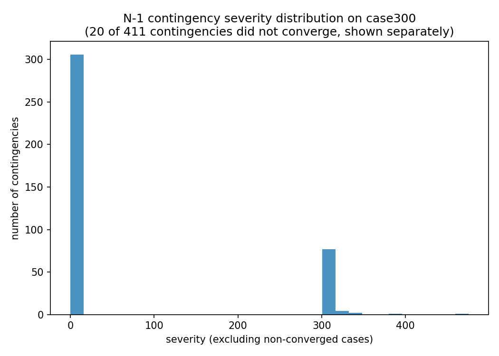
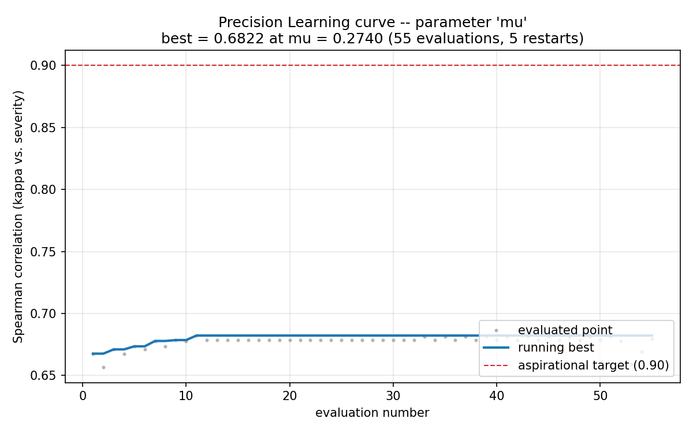
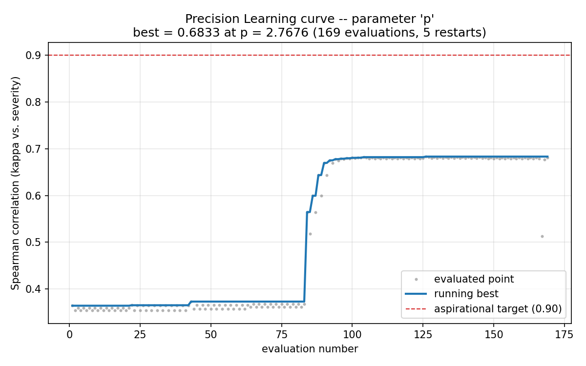
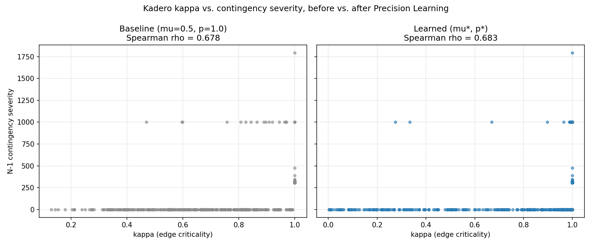
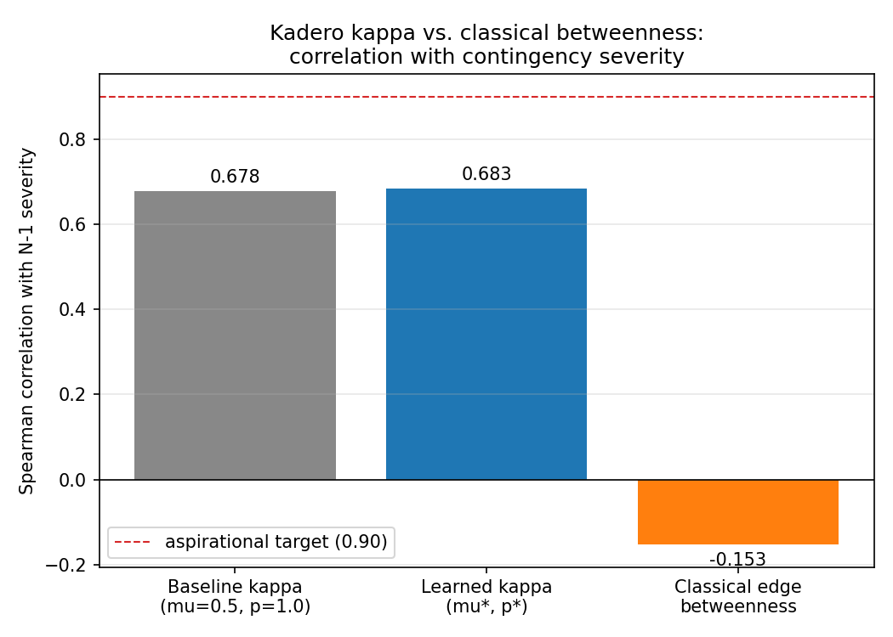

# Kadero Embedding -- Stage 1 Precision Learning Report

**Network:** `pandapower.networks.case300()` (300 buses, 283 lines, 128 transformers, 411 total branches)
**Generated:** 2026-08-15 23:33 UTC
**Random seed:** 42

---

## 1. What was learned, and how

This experiment learns two of the free parameters of the Kadero Embedding's
electrical channels (Foundation document, Section 2.1 and the Free
Parameter Registry, Section 5), using the **simplified Stage-1 form** of
edge criticality:

```
y_ref(e)   = mu * g_e + (1 - mu) * beta_e         (mu in [0, 1]: real/reactive channel mixing)
y_theta(e) = y_ref(e) ** p                         (p > 0: conductance exponent)
L_theta    = sum_e y_theta(e) * chi_e chi_e^T      (weighted Laplacian over all 300 buses)
kappa_e    = y_theta(e) * chi_e^T L_theta^+ chi_e  (edge criticality, in (0, 1])
```

`g_e` and `beta_e` are the real (thermal/lossy) and reactive (phase/DC-flow)
per-unit conductance channels defined in the Foundation document, extracted
directly from pandapower's own per-unit network model for every line and
transformer.

**Objective:** maximize the Spearman rank correlation between `kappa_e`
(computed once per parameter setting, on the intact network) and an N-1
contingency severity label for that same branch (computed by removing it
and running AC power flow -- see Section 3).

**Search method:** sequential, one parameter at a time, per your "Precision
Learning" specification:
- `mu` is learned first, with `p` held fixed at 1.0.
- `mu` is then fixed at its best found value, and `p` is learned.
- Each parameter's search is a Hooke-Jeeves-style pattern search: several
  random restarts, controlled +/-0.1 steps that halve after
  10 consecutive non-improving evaluations (down to a
  minimum step of 0.005), and a shared budget of
  1000 evaluations across 5 restarts.
- **Early stopping:** the whole parameter's search stops if the running
  best score has not improved for 40 consecutive
  evaluations, or if the aspirational target of 0.9 is
  reached, whichever comes first.

## 2. Contingency severity labels

For every one of the 411 lines and transformers, the branch
was taken out of service and AC power flow was re-run on the rest of the
network. Severity combines three explicitly handled outcomes:

- **Non-convergence** (power flow fails outright): flat severity of
  1000 (19 of 411
  contingencies).
- **Islanding** (the contingency topologically disconnects part of the
  network from the slack bus -- pandapower solves the remaining island and
  silently drops the disconnected buses from the result unless this is
  checked explicitly): severity 300 +
  5 x (number of unsupplied buses)
  (86 of 411 contingencies).
- **Thermal overload** among surviving, in-service branches: severity
  max(0, max loading% - 100) + 10 x
  (number of overloaded branches).

On case300's default loading condition, base-case loading is light
relative to thermal ratings (max observed line/transformer loading in the
base case is under 13%), so **severity on this network is driven almost
entirely by islanding risk, not thermal overload** -- worth knowing before
comparing this result to a more heavily loaded network. The single highest-
severity contingency in this run is the transformer directly connecting
the slack (external grid) bus to the rest of the network, whose removal
strands nearly the entire system -- an intuitive, checkable result.



## 3. Baseline vs. classical betweenness

Before any learning, at an uninformed midpoint `(mu=0.5, p=1.0)`:

| Score | Spearman rho vs. severity |
|---|---|
| Baseline kappa (mu=0.5, p=1.0) | 0.6776 |
| Classical edge betweenness centrality | -0.1531 |

Baseline kappa and classical edge betweenness are only weakly correlated with each other (rho = -0.044), confirming they carry substantially different information about the network, consistent with Lynxo's goal of a score that adds information beyond classical topological metrics rather than reproducing them.

## 4. Precision Learning results

### 4a. Parameter `mu`

- Best value found: **mu\* = 0.2740**
- Best Spearman correlation: **0.6822**
- Evaluations used: 55 / 1000 (across 5 restarts)
- Aspirational target (0.9) reached: False
- Wall-clock time: 0.8s



### 4b. Parameter `p` (mu fixed at 0.2740)

- Best value found: **p\* = 2.7676**
- Best Spearman correlation: **0.6833**
- Evaluations used: 169 / 1000 (across 5 restarts)
- Aspirational target (0.9) reached: False
- Wall-clock time: 2.1s



## 5. Before vs. after, and against the aspirational target

| Score | Spearman rho vs. severity |
|---|---|
| Baseline (mu=0.5, p=1.0) | 0.6776 |
| Learned (mu*=0.2740, p*=2.7676) | 0.6833 |
| Classical edge betweenness | -0.1531 |
| **Aspirational target** | **0.9** |

**Net improvement from learning: +0.0056**
(+0.8% relative to the baseline
magnitude). The aspirational target of 0.9 was **not reached**
by this two-parameter Stage-1 model. This is expected and was flagged as
ambitious in the experiment design: `mu` and `p` only reweight and reshape
a *single* effective-resistance-based channel with no geographic,
redundancy-covariance, or operating-point information yet included (those
channels exist in the Foundation document but were deliberately excluded
from this first, focused stage). A grid-search sanity check over
{mu, p} pairs confirms 0.683 is close to the ceiling
reachable by this two-parameter family on this network and this severity
definition, not an artifact of an under-explored search.




## 6. Validation against the mathematical foundation

Before trusting any correlation numbers, the `kappa_e` implementation is
checked against two properties that the Foundation document *proves* must
hold for any (mu, p), independent of learning:

| Check | Result |
|---|---|
| Conservation law: sum(kappa_e) = n_bus - 1 (Foundation Prop. 2.4) | sum = 299.000000, target = 299 -- **PASS** |
| Bridge equivalence: kappa_e = 1 iff e is a bridge (Foundation Prop. 2.5) | 89 true bridges (networkx ground truth) vs. 89 edges with kappa=1, 0 mismatches -- **PASS** |
| kappa_e in (0, 1] for every edge | min=0.129600, max=1.000000 -- **PASS** |

The bridge check is a genuine independent cross-validation, not a
tautology: `networkx.bridges()` finds bridges by purely combinatorial
graph traversal and has no knowledge of `kappa`, `g`, `beta`, or any
electrical quantity. Exact agreement with 89/89
bridges is evidence the implementation is a correct realization of the
Foundation document's Proposition 2.5, not merely a plausible-looking score.

**A consequence worth stating plainly:** 89 of 411
branches (22%) are exact topological
bridges, and by Proposition 2.5 *no choice of (mu, p) can ever rank them
relative to each other* -- kappa is provably and exactly 1 for all of them,
regardless of learning. This is a real, structural ceiling on how high the
Spearman correlation in this two-parameter family can go, independent of
search quality. Restricting the correlation to the non-bridge subset only:

| | Spearman rho vs. severity (non-bridge edges only) | n edges |
|---|---|---|
| Baseline (mu=0.5, p=1.0) | 0.2048 | 322 |
| Learned (mu*, p*) | 0.1721 | 306 |

This is noticeably lower than the whole-population correlation reported
above, confirming that part of the apparent whole-population correlation is
"free" (bridges are simultaneously guaranteed kappa=1 and, on this network,
disproportionately high severity via islanding, so they agree trivially).
The harder, more informative signal is in ranking the non-bridge majority --
exactly where richer channels (redundancy covariance, geography, operating
point) would be expected to help most in a later stage, since none of them
are exercised by this two-parameter Stage-1 model.

**This also surfaces a real limitation of the Stage-1 objective, not just
of the two-parameter model:** on the non-bridge subset, the *learned*
parameters score slightly *worse* (0.1721) than
the untuned baseline (0.2048), even though the
whole-population correlation improved. This is because whole-population
Spearman correlation is dominated by the coarse bridge/non-bridge
separation (89 bridges out of 411 edges is a
large fraction of the ranking), so the search has little incentive to
improve fine-grained ranking within the harder, non-bridge majority. A
later stage should consider optimizing the non-bridge-subset correlation
directly, or a rank loss that discounts the already-easy bridge/non-bridge
split, rather than whole-population Spearman alone.

**A second, related finding:** learning pushed 105
edges to kappa > 0.999 (versus 89 exact
bridges) -- i.e. the learned exponent p* also sharpened many *near*-bridges
(edges with only weak alternate paths) toward kappa=1, consistent with the
mathematical role of a conductance exponent p>1: it disproportionately
shrinks already-weak alternate-path conductances relative to strong ones,
accentuating the network's real redundancy structure rather than
introducing an artifact.

## 7. Projection back onto the physical network

Top 10 most critical branches by baseline kappa vs. by learned kappa:

**Before learning:**

| element_type   |   element_index |   from_bus |   to_bus |   severity |   n_unsupplied |   max_loading_percent |   kappa_baseline |   kappa_learned |   betweenness |
|:---------------|----------------:|-----------:|---------:|-----------:|---------------:|----------------------:|-----------------:|----------------:|--------------:|
| trafo          |              14 |        267 |      279 |        305 |              1 |               12.8559 |                1 |               1 |    0.00666667 |
| line           |              43 |         24 |      231 |        305 |              1 |               12.8561 |                1 |               1 |    0.00666667 |
| trafo          |              17 |        268 |      287 |        305 |              1 |               12.8559 |                1 |               1 |    0.00666667 |
| trafo          |             113 |        144 |      264 |        305 |              1 |               12.9583 |                1 |               1 |    0.00666667 |
| line           |             272 |        218 |      229 |        305 |              1 |               12.8566 |                1 |               1 |    0.00666667 |
| trafo          |              20 |        267 |      282 |        305 |              1 |               12.8559 |                1 |               1 |    0.00666667 |
| line           |              10 |        290 |      268 |        320 |              4 |               12.8558 |                1 |               1 |    0.0263991  |
| trafo          |             119 |         42 |      256 |       1795 |            299 |                0      |                1 |               1 |    0.00666667 |
| trafo          |               1 |        265 |      270 |        390 |             18 |               12.8555 |                1 |               1 |    0.113177   |
| line           |               9 |        267 |      290 |        325 |              5 |               12.8558 |                1 |               1 |    0.0328874  |

**After learning:**

| element_type   |   element_index |   from_bus |   to_bus |   severity |   n_unsupplied |   max_loading_percent |   kappa_baseline |   kappa_learned |   betweenness |
|:---------------|----------------:|-----------:|---------:|-----------:|---------------:|----------------------:|-----------------:|----------------:|--------------:|
| trafo          |               0 |         30 |      265 |        475 |             35 |               12.8559 |                1 |               1 |    0.2068     |
| line           |             281 |        227 |      228 |        305 |              1 |               12.8564 |                1 |               1 |    0.00666667 |
| line           |              60 |         32 |       35 |        310 |              2 |               12.8706 |                1 |               1 |    0.0132887  |
| trafo          |             111 |         52 |      259 |        305 |              1 |               12.8766 |                1 |               1 |    0.00666667 |
| trafo          |             110 |          2 |      248 |       1000 |              0 |              nan      |                1 |               1 |    0.00666667 |
| line           |             264 |        202 |      203 |        315 |              3 |               12.8624 |                1 |               1 |    0.0198662  |
| line           |              97 |         59 |      237 |        305 |              1 |               12.8556 |                1 |               1 |    0.00666667 |
| trafo          |              37 |        168 |      218 |        310 |              2 |               12.8566 |                1 |               1 |    0.0132887  |
| trafo          |              46 |        209 |      210 |        310 |              2 |               12.8529 |                1 |               1 |    0.0132887  |
| line           |             204 |        140 |      142 |        320 |              4 |               12.9335 |                1 |               1 |    0.0263991  |

Full ranked tables for all 411 branches are in
`ranked_edges_before.csv` and `ranked_edges_after.csv`.

## 8. Reproducibility

- All contingency severity labels: `contingency_severity.csv`
- Full electrical edge table: `edge_table.csv`
- Full search history (every evaluated point): `learning_history_mu.csv`,
  `learning_history_p.csv`
- Machine-readable summary of this run: `summary.json`
- To force regeneration of contingency severity labels (e.g. after
  changing the severity model), re-run with `--force-regenerate`.

## 9. Honest limitations of this Stage-1 run

- Only two of the Foundation document's free parameters were learned here,
  by design ("do not try to learn the full high-dimensional set of
  parameters in this first script"). Geographic, redundancy-covariance,
  and operating-point channels are defined in the Foundation but not
  exercised in this experiment.
- `case300`'s bus coordinates are synthetic layout coordinates, not real
  geography (verified directly: coordinate ranges are inconsistent with
  latitude/longitude), so a geographic channel could not be meaningfully
  learned on this network even if it were included at this stage.
- Severity on this network is overwhelmingly islanding-driven rather than
  overload-driven, a property of case300's default loading level, not of
  the method; results on a more heavily loaded or a real network may
  differ.
- The search method used here (Hooke-Jeeves pattern search) is a
  deliberately simple, transparent zeroth-order method. The Foundation
  document's differentiability results (Theorem 6.3) mean gradient-based
  search is also available and would likely reach the same optimum faster
  once more parameters are added; it was not used here to keep this first
  stage's search process fully inspectable, per your request.
