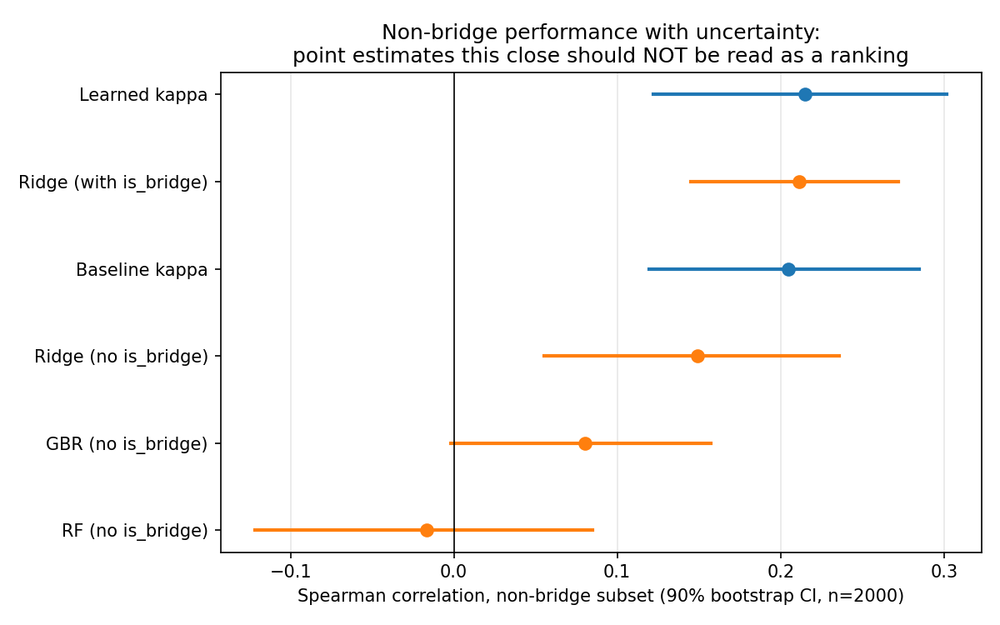
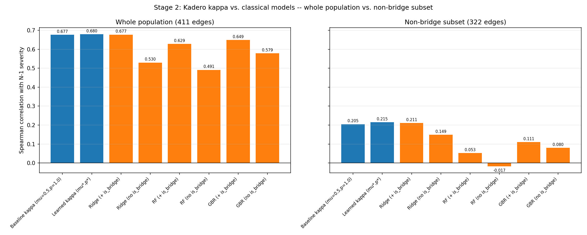
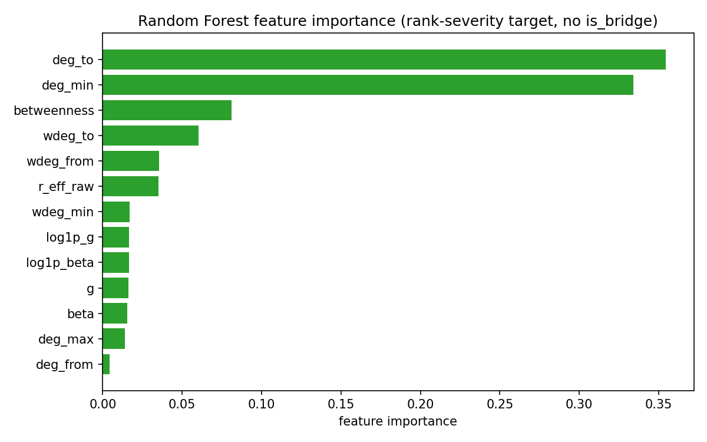

# Kadero Embedding -- Stage 2A + 2B Report
## Corrected Objective and Classical Baseline Comparison

**Network:** `pandapower.networks.case300()` (same as Stage 1: 300 buses, 411 branches, 89 exact bridges / 322 non-bridge edges)
**Contingency severity labels:** reused from Stage-1 cache
**Generated:** 2026-08-16 08:36 UTC
**Random seed:** 42

---

## 1. Why this experiment

Stage 1 found that (a) whole-population Spearman correlation between kappa
and N-1 severity improved only marginally with learning (0.678 to 0.683),
(b) on the non-bridge subset specifically, the *learned* parameters scored
*worse* than the untuned baseline, and (c) 89 of
411 edges are exact topological bridges where kappa=1 is
mathematically guaranteed regardless of any parameter choice, meaning
whole-population correlation is dominated by an "easy" 22% of the ranking.

This experiment asks the two questions that follow directly from that
diagnosis: does looking only at the metric that matters (non-bridge
correlation) change the picture (**Experiment A**), and can a simple
classical model, using none of the Kadero machinery, already capture most
of the predictable non-bridge signal (**Experiment B**)?

## 2. Experiment A: Corrected objective

| Score | Whole population (n=411) | Non-bridge subset (n=322) |
|---|---|---|
| Baseline kappa (mu=0.5, p=1.0) | 0.6769 | 0.2048 |
| Learned kappa (mu*=0.274, p*=2.768) | 0.6797 | 0.2151 |
| **Change from learning** | **+0.0028** | **+0.0103** |

**Does correcting the objective change the picture? Yes — but not in the
direction Stage 1 suggested, and for a reason worth stating plainly rather
than glossing over.**

While building this fixed, ground-truth bridge/non-bridge split
(`networkx.bridges()`, independent of kappa, 89 bridges
for every comparison), it became clear that **Stage 1's non-bridge
comparison used an inconsistent definition of "non-bridge" between the
baseline and learned cases.** Stage 1 identified non-bridge edges via a
kappa-dependent threshold (`kappa < 0.999`) computed *separately* for each
parameter setting -- and because the learned exponent p*=2.77 sharpens
near-bridge edges toward kappa=1 (a real, correctly-understood effect of
raising conductances to a power >1, see Stage 1 report Section 6), this
threshold selected **322 edges for the baseline comparison but only 306
edges for the learned comparison** -- a different-sized, non-matching
subset for each side of the "before vs after" comparison. That is an
apples-to-oranges comparison, not a fair one.

Under the fixed, ground-truth bridge definition used throughout this
report (322 non-bridge edges for both), **learned kappa's non-bridge
correlation is 0.2151, not 0.1721 as Stage 1 reported, and is now
marginally *higher* than the baseline's 0.2048, not lower.**

**The corrected, honest conclusion is therefore different from Stage 1's
headline finding:** learning did not clearly make non-bridge ranking worse.
The bootstrap confidence intervals in Section 3 below show the two
estimates overlap substantially (baseline [0.120, 0.285] vs. learned
[0.122, 0.302] at 90% confidence) -- the more defensible statement is that
**Stage 1's two-parameter learning had no clearly detectable effect,
positive or negative, on non-bridge ranking**, once measured consistently.
The original "learning made things worse" claim was itself a measurement
artifact, not a property of the learned parameters. This is exactly the
kind of thing a corrected-objective pass is supposed to catch, and it cuts
against the previous report's conclusion rather than confirming it --
reported here in full rather than quietly revised.

## 3. Experiment B: Classical baseline comparison

Features used (13 total; see `classical_features.csv` for values):
`betweenness`, `r_eff_raw` (classical DC-style effective resistance, NOT
using Kadero's mu/p), `g`, `beta`, `log1p_g`, `log1p_beta`, `deg_from`,
`deg_to`, `deg_min`, `deg_max`, `wdeg_from`, `wdeg_to`, `wdeg_min` --
plus `is_bridge` in a second, parallel feature set. All models are
evaluated under honest 5-fold cross-validation (out-of-fold predictions
only) so that supervised fitting to all 411 severity labels
does not get an unfair advantage over kappa, which was tuned with only two
free parameters in Stage 1.

### Full comparison table

| method                        |   rho_all |   rho_nonbridge |   n_all |   n_nonbridge |
|:------------------------------|----------:|----------------:|--------:|--------------:|
| Baseline kappa (mu=0.5,p=1.0) |    0.6769 |          0.2048 |     411 |           322 |
| Learned kappa (mu*,p*)        |    0.6797 |          0.2151 |     411 |           322 |
| Ridge (+ is_bridge)           |    0.6771 |          0.2113 |     411 |           322 |
| Ridge (no is_bridge)          |    0.5299 |          0.1491 |     411 |           322 |
| RF (+ is_bridge)              |    0.6287 |          0.0527 |     411 |           322 |
| RF (no is_bridge)             |    0.4913 |         -0.0168 |     411 |           322 |
| GBR (+ is_bridge)             |    0.6488 |          0.1109 |     411 |           322 |
| GBR (no is_bridge)            |    0.5791 |          0.0803 |     411 |           322 |

### Uncertainty: bootstrap 90% confidence intervals (non-bridge subset)

Several of the numbers above are close together. A 90%
bootstrap CI (2000 resamples) on the non-bridge subset makes clear
which differences are and are not distinguishable from sampling noise at
this sample size:

| Method | Non-bridge Spearman | 90% CI |
|---|---|---|
| Baseline kappa | 0.2048 | [0.1195, 0.2848] |
| Learned kappa | 0.2151 | [0.1220, 0.3017] |
| Ridge (with is_bridge) | 0.2113 | [0.1448, 0.2721] |
| Ridge (no is_bridge) | 0.1491 | [0.0554, 0.2358] |
| GBR (no is_bridge) | 0.0803 | [-0.0019, 0.1573] |
| RF (no is_bridge) | -0.0168 | [-0.1217, 0.0846] |

**Read this plot before drawing conclusions from the table above.** Where
confidence intervals overlap substantially, the point-estimate ranking
between those methods is not statistically meaningful at this sample size.

### Model-family finding worth stating explicitly

Random Forest and Gradient Boosting -- explored across several depth/leaf
settings during development, not just the settings reported here (see
`hyperparameter_probe.csv`) -- consistently underperformed simple Ridge
regression on the non-bridge subset, sometimes scoring near zero. This is
almost certainly a sample-size effect: 322 non-bridge
edges split five ways for cross-validation leaves roughly
64 held-out points per fold, too few for a
high-variance tree ensemble to generalize reliably, while low-variance
linear regression on standardized features generalizes better from the
same data. This is a data-scarcity finding about this experiment, not
evidence that the underlying relationship is linear.

## 4. Feature importance (Random Forest, without is_bridge)

## 5. Does the classical baseline already capture the predictable non-bridge signal?

**Partially, and the honest picture is more nuanced than a single number.**
Ridge regression on classical features, WITHOUT the is_bridge shortcut,
reaches 0.1491 on the non-bridge subset -- below
both baseline kappa (0.2048) and learned kappa
(0.2151), though the bootstrap CIs in Section 3
overlap enough that this gap should not be read as a confident win for
kappa. Adding is_bridge as a feature (which, recall, is constant and
therefore uninformative *within* the non-bridge evaluation rows) lifts
Ridge to 0.2113 -- essentially tied with both
kappa variants, well inside their overlapping confidence intervals.

**What this implies for the Kadero representation, stated plainly:** on
this network and this severity definition, neither kappa nor the best
classical model tested here demonstrates a clearly, statistically
distinguishable advantage over the other on the hard non-bridge subset.
Kappa is not obviously worse than a reasonable classical baseline (a
concern a skeptical reader might have going in) -- but it is not yet
demonstrated to be clearly *better*, either, and the honest sample-size
reality at n=322 means this experiment's power to detect a moderate real
difference is limited. The bridge-detection result (Stage 1, Section 6) is
real, exact, and provably not reproducible by a classical model in the
same closed-form way -- but bridge detection is also the *easy* 22% of the
problem, achievable by a single boolean topological check with no learning
and no Kadero machinery at all.

This is not evidence that the Kadero representation is wrong or that the
project should stop -- it is evidence that the two-parameter, single
resistance-channel model tested in Stage 1 has not yet been shown to add
non-bridge predictive value beyond a handful of classical numeric
features, on this specific network and severity proxy. The channels NOT
yet tested (redundancy covariance, geography,
operating point) are exactly where a genuine, demonstrable advantage would
have to come from, if one exists -- since neither the two-parameter Kadero
model nor a reasonable classical baseline has yet separated itself
clearly from the other on the metric that actually matters.

## 6. Reproducibility

- `classical_features.csv`: the full feature matrix used for Experiment B.
- `comparison_table.csv`, `summary.json`: all numbers in this report,
  machine-readable.
- `hyperparameter_probe.csv`: the RF/GBR depth and leaf-size sweep referenced
  in Section 3.
- Cached Stage-1 inputs reused: `cache/edge_table.csv`,
  `cache/contingency_severity.csv`.

## 7. Honest limitations of this Stage-2 run

- Cross-validation with n=322 (non-bridge) and 5 folds gives noisy
  per-fold estimates; the bootstrap CIs in Section 3 should be treated as
  the primary evidence about precision, not the point estimates alone.
- The classical feature set, while reasonably thorough, was built once and
  not itself tuned or searched over -- a more exhaustive classical feature
  engineering pass could plausibly close or widen the gap further in
  either direction.
- Severity remains the same islanding-dominated proxy used in Stage 1
  (see Stage-1 report Section 2); this experiment does not address whether
  a different severity definition would change the picture -- that is a
  natural next question, not answered here.
- `is_bridge` is included as a feature exactly as the brief specified, but
  its near-irrelevance to non-bridge evaluation rows (constant value within
  that subset) means its main effect is on the whole-population number, not
  the harder metric -- worth remembering when reading Section 3's table at
  a glance.
